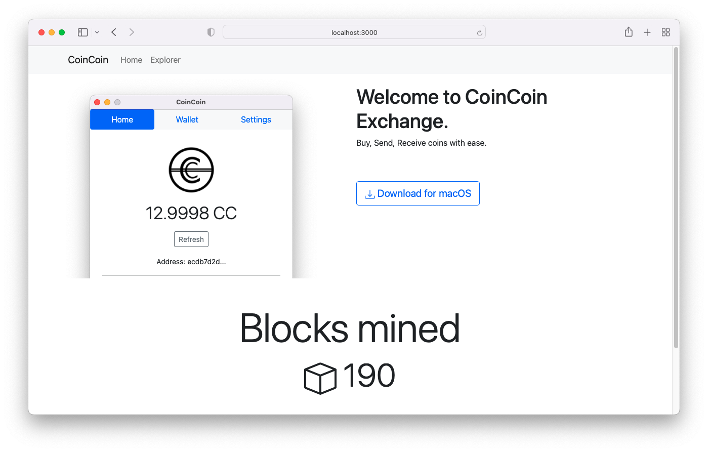
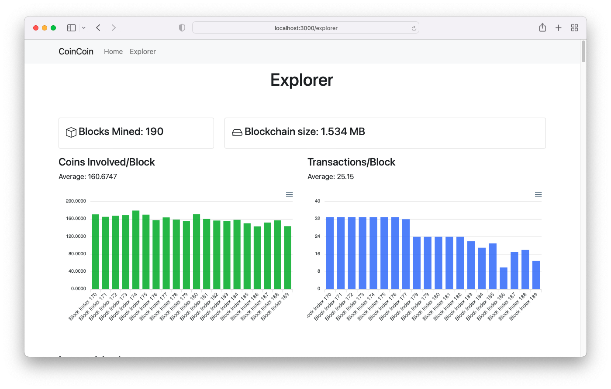
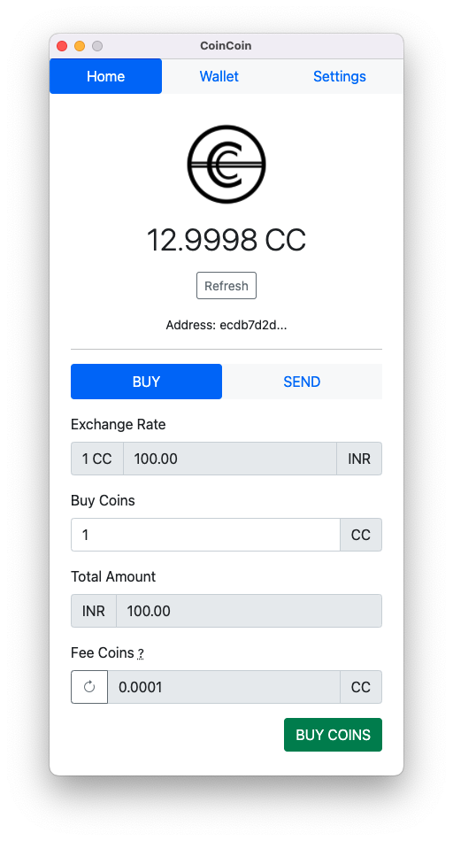

# blockchain-project
This is a simple blockchain project.


# CoinCoin

This project creates a simple cryptocurrency called CoinCoin (CC) and also gives you the following
* Backend REST APIs using NodeJS.
* Desktop app for macOS using Electron
* Website using React

**This is just an experimental project.**

Hope you will find it interesting :)

Find me on [yusufshakeel.com](https://yusufshakeel.com)


#### Website



#### Explorer



#### Desktop app



## Table of Content

* [Getting started](#getting-started)
* [Services](#services)
  * [Exchange](#exchange)
  * [Miner](#miner)
  * [Transaction](#transaction)
  * [Wallet](#wallet)

## Getting started

### Install packages

Go inside each of the services that are placed inside the `services` folders
and run the following command to install the packages.

```shell
npm i
```

## Services

### Exchange

This is the exchange service.

* It lists all the blocks in the block chain.
* It shows all the transactions that are in the mempool.
* It is the place to buy coins.

#### Tests

To run the tests run the following in the terminal.

```shell
npm run test
```

#### Start local server

Run the following in the terminal.

```shell
npm run start
```

#### Swagger doc

```text
http://localhost:10101/documentation/static/index.html
```


### Miner

This is the miner service.

* This service mines block.

#### Tests

To run the tests run the following in the terminal.

```shell
npm run test
```

#### Start local server

Run the following in the terminal.

```shell
npm run start
```

#### Swagger doc

```text
http://localhost:10102/documentation/static/index.html
```


### Transaction

This is the transaction service.

* This helps in making transactions.

#### Tests

To run the tests run the following in the terminal.

```shell
npm run test
```

#### Start local server

Run the following in the terminal.

```shell
npm run start
```

#### Swagger doc

```text
http://localhost:10103/documentation/static/index.html
```


### Wallet

This will help create wallet.

* Wallet consists of public key, private key and address.

#### Bootstrap

This will create `output` folder with some public, private and address.

```shell
npm run bootstrap
```

#### Tests

To run the tests run the following in the terminal.

```shell
npm run test
```

#### Start local server

Run the following in the terminal.

```shell
npm run start
```

#### Swagger doc

```text
http://localhost:10104/documentation/static/index.html
```

## License

It's free :smiley:

[MIT License](https://github.com/yusufshakeel/blockchain-project/blob/main/LICENSE) Copyright (c) 2022 Yusuf Shakeel

### Donate

Feeling generous :smiley: [Donate via PayPal](https://www.paypal.me/yusufshakeel)