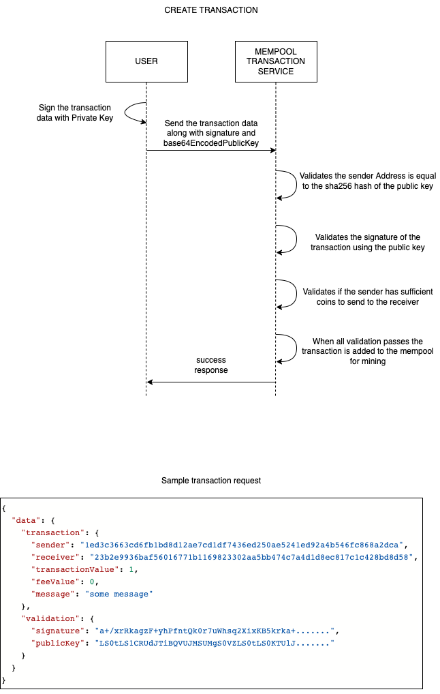

# Blockchain

## Table of Content

* [Wallet](#wallet)
* [Sign and Verify transaction](#sign-and-verify-transaction)
* [Coin](#coin)
* [Structure of the block](#structure-of-the-block)
* [Proof of Work](#proof-of-work)
* [Hash of the block](#hash-of-the-block)
* [Structure of the transaction](#hash-of-the-block)

## Wallet

The wallet service generates public key, private key and address for transaction.

### Public, Private key pair

The public-private key pair is generated like the following.

```javascript
const { publicKey, privateKey } = crypto.generateKeyPairSync('rsa', {
  modulusLength: 2048,
  publicKeyEncoding: { type: 'spki', format: 'pem' },
  privateKeyEncoding: { type: 'pkcs8', format: 'pem' }
});
```

Then the keys are base64 encoded.

```javascript
const base64EncodedPublicKey = Buffer.from(publicKey, 'ascii').toString('base64');
const base64EncodedPrivateKey = Buffer.from(privateKey, 'ascii').toString('base64');
```

The base64 encoded keys are saved by the user.

Note the ***private key*** should be kept as a secret. It is used to sign the transaction.

### Address for transaction

The address for transaction is a sha256 hash of the public key.

```javascript
const address = crypto.createHmac('sha256', publicKey).digest('hex');
```

### Sign and Verify transaction

Transaction data is signed by the private key by the user and sent to the mempool transaction service.

Before the transaction is added to the mempool the signature is verified by the public key of the user.



## Coin

When a block is mined by miner **128** coins is issued.

Every **1024** (2^10) blocks the number of coins issued will be halved.

## Structure of the block

The structure of a block in this project.

```json
{
  "index": "integer",
  "nonce": "integer",
  "timestamp": "string-utc-timestamp",
  "previousHash": "string-sha256",
  "hash": "string-sha256",
  "transactions": []
}
```

A block can have max **16** transactions and min **1** transaction. 
And transactions should not be more than **16KB**.

On mining a block the miner is awarded crypto coins.

## Proof of Work

The `nonce` value calculated is the proof of work for this project.

## Hash of the block

To calculate the hash we will perform the following calculation.

```text
Hash = SHA256 of data

where, data is the following

data = index + nonce + timestamp + previousHash + transactions

All the values used above are stringified.
```

In order for a hash to be accepted it must have **4** leading zeros for this project.

## Structure of the transaction

The transaction will look like the following.

```json
{
  "uuid": "string",
  "sender": "string",
  "receiver": "string",
  "transactionValue": "number",
  "feeValue": "number",
  "rewardValue": "number",
  "message": "string",
  "timestamp": "string-utc-timestamp"
}
```